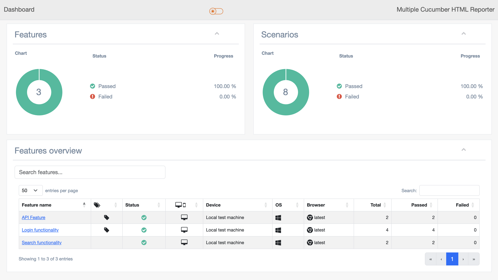

# cucumber-typescript-cypress
Automation Framework using Cucumber Typescript and Cypress

# Project Details
**🚀 Cypress + Cucumber + TypeScript Framework**

A modern, production-ready E2E testing framework designed for scalability and high performance. This repository demonstrates how to implement Behavior-Driven Development (BDD) with TypeScript, featuring parallel execution, automated reporting

** Getting Started**

Clone the repository
git clone https://github.com/theja30/cucumber-typescript-cypress.git

cd cucumber-typescript-cypress

**Install dependencies**
npm install

**Run Tests**

To execute a specific tag
npx cypress run --env tags="@Test"

To execute a specific Feature file
npx cypress run --spec cypress/e2e/features/login.feature

To generate the HTML report from the cucumber reports
npm run report

To clear the reports
npm run clean:reports  

To clear, Execute the features in parallel and generate the Report
npm run test:parallel 

Sample Report: /reports/html-report/index.html

